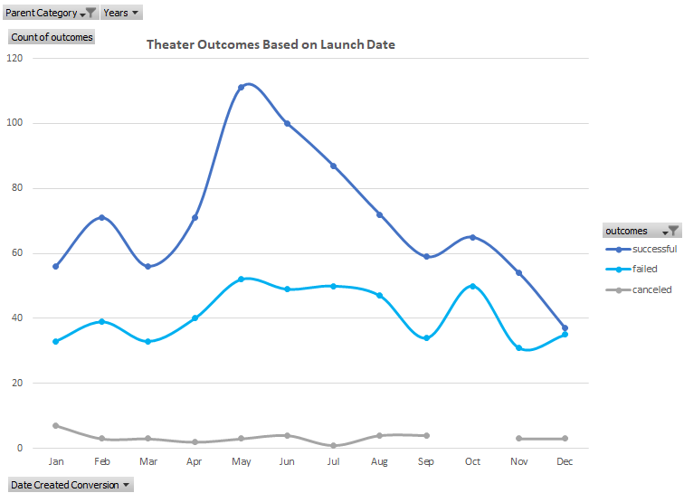
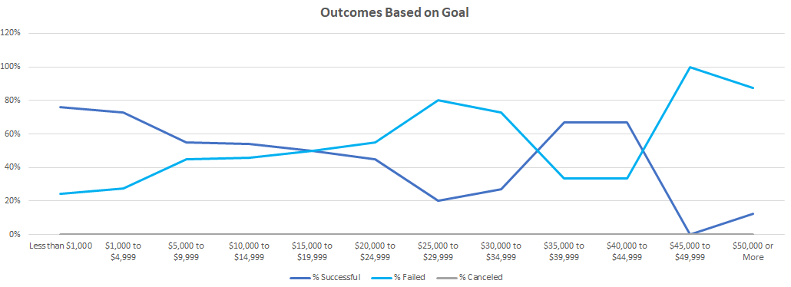

# Kickstarting with Excel

## Overview of Project

Louise is a playwriter looking to start a crowfunding campaign to raise $10,000 for her upcoming play. 
Because it is her first crowfunding, she wants more insights on how well other campaigns in her sector performed, and what factors contributed to a successful campaign.

### Purpose

The purpose of this analysis is to understand the performance of different fundraising campaigns in the theater industry based on their launch date and based on their predetermined goal. 
By understanding this, the probability of launching a succesfull campaign can potentially increase.

## Analysis and Challenges

Two main analysis were made;

1. Analysis of the outcome (successful/failed/canceled) of the Theater campaigns based on their launch date
2. Analysis of the outcome (successsul/failed/canceled) of the Plays subcategory based on the campaign goal 

### Analysis of Outcomes Based on Launch Date

In order to do this, the category and the subcategory were separated in the raw data by using the "Text to Columns" function in excel, and the launch date was found by converting a time stamp using the "Date" formula.
A pivot table was created, in which we could filter for the "Theater" parent category and for years. We broke down the data into months of the year, and analyzed the data based on count of the outcome, filtering out live campaigns.

Data was organized so successful outcomes show first, followed by failed outcomes, followed by canceled outcomes.
A line chart was created so the data is easier to understand, showing theater campaigns outcomes by their launch date month. The line was smoothed for a better appearance.

### Analysis of Outcomes Based on Goals

In order to do this, 12 groups were created based on the campaign goal. The "COUNTIFS" formula was used to calculate how many campaigns were on each group, and how may of those were successful, failed, or canceled.
The formula's ranges were the campaign's goal, and the subcategory "Plays".
Total amount of campaigns in each group was calculated using the "SUM" function, and the percentage of campiagns successful, failed, or canceled was easily found after this. 
A line chart was created so the data is easier to understand, showing the percentage of successful, failed, and canceled campaigns based on their goal.

### Challenges and Difficulties Encountered

A challenge I encountered during this analysis was working with the COUNTIFS formula. I found it very time consuming to be typing the criteria into the formula. 
I resolved this by adding the criteria in columns J and K of the wroksheet, and using that in my formula for easy dragging. 
Some difficulties that could be encountered by doing this is that there is room for error. One needs to double check that the correct cells were locked, and that the formula is grabbing the correct cells.
It would be easy to obtain an incorrect value, specially in the last group of $50,000 or more because the formula has to be adjusted to contain only two criterias instead of three. 

## Results

- What are two conclusions you can draw about the Outcomes based on Launch Date?

  1. 61% of the Theater campaigns were successful, 36% failed, and 3% were canceled.
  2. There is an increase in the number of theater campaigns launched during the months of May, June, and July. In May is when we see the highest amount of total campaigns, and the highest amount of successful camapaigns.

- What can you conclude about the Outcomes based on Goals?

  The first thing that caught my eye is that none of the 1,047 Plays campaigns were canceled. For that reason, the Canceled line in the chart is on the X axis.
  Also, the majority of the campaigns had a goal between $1,000 and $4,999. This group constituded over 50% of the total campaigns for the Plays subcategory.
  
  Additionally, 66% of the Plays campaigns were successful while 34% of the campaigns failed to meet the goal.
  The most successful campaigns are the ones where the goal is below $5,000. Overall, The higher the goal, the harder for the campaign to achieve the goal. However, the campaigns between $35K and $45k had a good success rate of 67%; neverthless, the sample size for this group is too small to determine if this is a common  trend.

- What are some limitations of this dataset?

  The outcome of the campaigns could be impacted by outside factors, such as marketing efforts, which are not reflected in this dataset.
  Additionally, there's no explanation on how the goal for each campaign was set; therefore, we don't know if any particular goal was unrealistic and the fundraising campaign failed  because of that.
  Lastly, the raw data contains goal and pledge amounts on multiple currencies. We would have to convert currency if we want to analyze the data based on actual money collected from the campaigns.

- What are some other possible tables and/or graphs that we could create?
  
  - We can analyze each campaign category and subcategory by country based on pledge amount instead of goals.
  - We can create another graph to show average donation per country.
  - We can create a chart showing number of backers per category and/or subcategory.
  - We can add another column in the raw data counting the total days the campaign was active, and see if there is any correlation between the number of days active and total funded amount.
